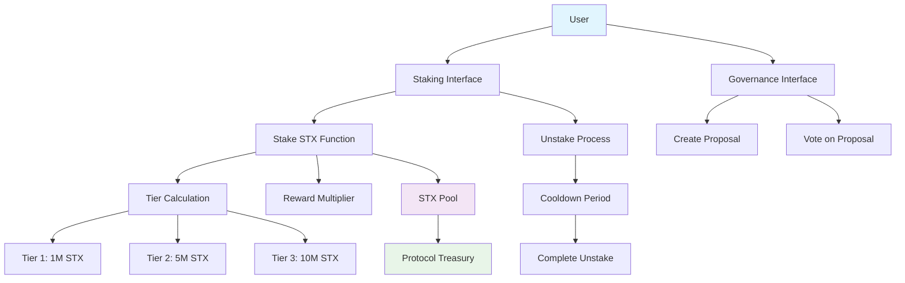
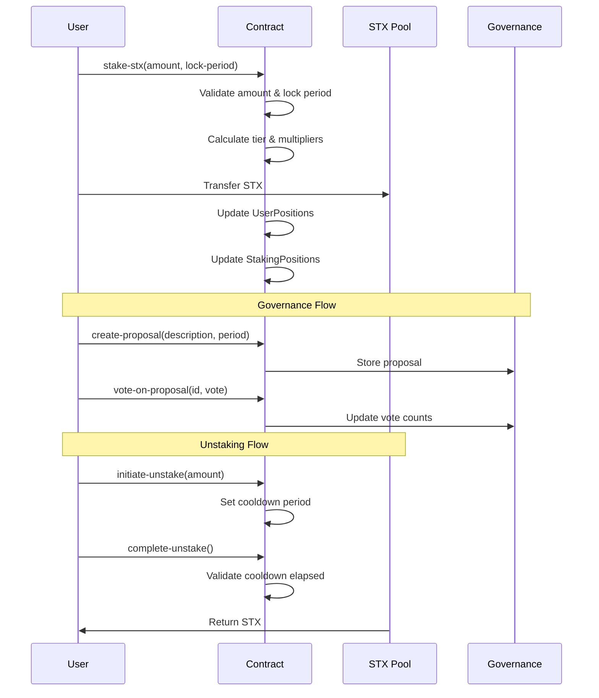

# Quantum Rewards Network (QRN)

[](https://stacks.co/)
[](https://clarity-lang.org/)
[](LICENSE)

> Next-Generation DeFi Infrastructure on Stacks Blockchain

## 🌟 Overview

Quantum Rewards Network (QRN) is a revolutionary decentralized finance protocol that transforms traditional staking into an intelligent, multi-tiered ecosystem. Built on the Stacks blockchain, QRN leverages Bitcoin's security model while introducing advanced governance mechanisms and dynamic reward optimization for maximum capital efficiency.

## 🚀 Key Features

- **Quantum-inspired Reward Calculations**: Exponential multipliers based on stake amount and lock duration
- **Multi-tiered Staking System**: Three tier levels with progressive benefits and multipliers
- **Time-weighted Governance**: Voting power based on staking commitment with decay mechanisms
- **Emergency Controls**: Pause functionality and emergency mode for protocol security
- **Automated Liquidity Optimization**: Smart treasury management through STX pooling
- **Advanced Analytics Integration**: Real-time performance monitoring via analytics tokens

## 🏗️ System Architecture



## 📊 Contract Architecture

### Core Components

#### 1. **Token Definition**

- `ANALYTICS-TOKEN`: Fungible token for advanced analytics features

#### 2. **Data Structures**

- **UserPositions**: Comprehensive user state including collateral, debt, and staking info
- **StakingPositions**: Detailed staking records with lock periods and rewards
- **Proposals**: Governance proposal management with voting mechanisms
- **TierLevels**: Configurable tier system with benefits and multipliers

#### 3. **Protocol Constants**

```clarity
ERR-NOT-AUTHORIZED     (u1000)  // Access control errors
ERR-INVALID-PROTOCOL   (u1001)  // Protocol validation errors  
ERR-INSUFFICIENT-STX   (u1003)  // Insufficient balance errors
ERR-COOLDOWN-ACTIVE    (u1004)  // Cooldown period violations
```

### Tier System

| Tier | Minimum Stake | Reward Multiplier | Features |
|------|---------------|-------------------|----------|
| 1    | 1M STX        | 1.0x              | Basic staking |
| 2    | 5M STX        | 1.5x              | Enhanced rewards + governance |
| 3    | 10M STX       | 2.0x              | Premium features + priority access |

### Lock Period Benefits

| Lock Period | Duration | Multiplier |
|-------------|----------|------------|
| No Lock     | 0 blocks | 1.0x       |
| Short Lock  | 1 month  | 1.25x      |
| Long Lock   | 2 months | 1.5x       |

## 🔄 Data Flow



## 🛠️ Installation & Setup

### Prerequisites

- [Clarinet](https://github.com/hirosystems/clarinet) - Stacks development tool
- [Node.js](https://nodejs.org/) (v16 or later)
- [Git](https://git-scm.com/)

### Quick Start

1. **Clone the repository**

   ```bash
   git clone https://github.com/your-repo/quantum-rewards-network.git
   cd quantum-rewards-network
   ```

2. **Install dependencies**

   ```bash
   npm install
   ```

3. **Initialize Clarinet project**

   ```bash
   clarinet check
   ```

4. **Run tests**

   ```bash
   npm test
   ```

## 🧪 Testing

The project includes comprehensive test suites covering:

- **Staking Mechanics**: Tier calculations, lock periods, reward multipliers
- **Governance System**: Proposal creation, voting mechanisms, validation
- **Security Features**: Access controls, pause functionality, cooldown periods
- **Edge Cases**: Error handling, boundary conditions, state transitions

Run the test suite:

```bash
clarinet test
```

## 📈 Usage Examples

### Staking STX

```clarity
;; Stake 5M STX with 1-month lock
(contract-call? .quantum-rewards-network stake-stx u5000000 u4320)
```

### Creating Governance Proposal

```clarity
;; Create proposal with 1-day voting period
(contract-call? .quantum-rewards-network 
  create-proposal 
  u"Increase base reward rate to 6%" 
  u2880)
```

### Voting on Proposals

```clarity
;; Vote in favor of proposal #1
(contract-call? .quantum-rewards-network vote-on-proposal u1 true)
```

## 🔐 Security Features

- **Access Control**: Owner-only administrative functions
- **Pause Mechanism**: Emergency contract suspension capability
- **Cooldown Periods**: Prevents rapid unstaking manipulation
- **Input Validation**: Comprehensive parameter checking
- **Error Handling**: Detailed error codes for debugging

## 🗺️ Roadmap

### Phase 1: Core Protocol ✅

- [x] Multi-tier staking system
- [x] Governance framework
- [x] Basic security controls

### Phase 2: Advanced Features 🚧

- [ ] Cross-chain compatibility
- [ ] Advanced analytics dashboard
- [ ] Automated rebalancing mechanisms

### Phase 3: Ecosystem Expansion 📋

- [ ] Integration with major DeFi protocols
- [ ] Mobile application
- [ ] Institutional features

## 🤝 Contributing

We welcome contributions from the community! Please read our [Contributing Guidelines](CONTRIBUTING.md) before submitting pull requests.

### Development Workflow

1. Fork the repository
2. Create a feature branch
3. Make your changes
4. Add tests for new functionality
5. Submit a pull request

## 📄 License

This project is licensed under the MIT License - see the [LICENSE](LICENSE) file for details.

## 🏆 Acknowledgments

- Built on [Stacks Blockchain](https://stacks.co/)
- Powered by [Clarity Smart Contracts](https://clarity-lang.org/)
- Security audited by [Audit Firm Name]

---

**Disclaimer**: This software is provided "as is" without warranty of any kind. Users should conduct their own research and due diligence before interacting with the protocol.
